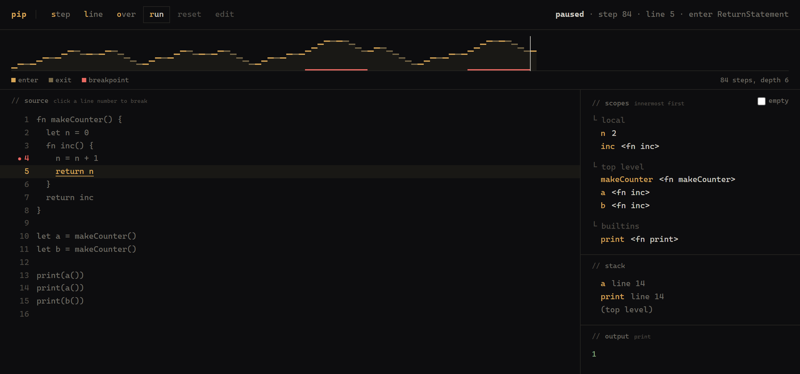
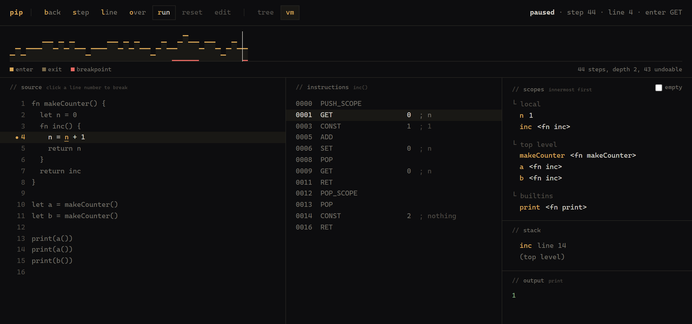
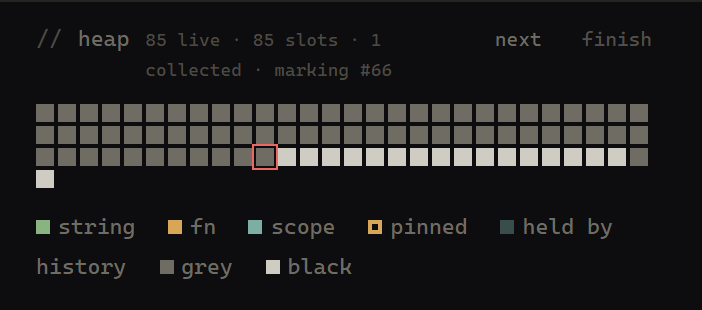

# Pip

A small dynamic language whose evaluator is a generator. Stepping the
interpreter is a call to `.next()`, so single-stepping, breakpoints and
step-back fall out of the design instead of being bolted on. The garbage
collector is a generator too, so a collection is something you step rather
than something you infer from a number that changed.

**[Open the debugger](https://neeraj9112.github.io/generator-interpreter/)**

[](https://neeraj9112.github.io/generator-interpreter/)

Vanilla JS, no runtime dependencies and no build step. The page loads `src/`
into the browser as ES modules; `typescript` and `@types/node` are dev
dependencies that type-check the JavaScript through JSDoc and compile nothing.

```
npm test        # node:test
npm run typecheck
npm run web     # the debugger on localhost:8080
npm run pip -- examples/counter.pip
```

## Running a program

`node src/cli.js file.pip` runs a file and prints whatever `print` wrote.

```
$ node src/cli.js examples/counter.pip
1
2
1
```

The bytecode VM runs it by default. `--tree` picks the tree-walking evaluator
instead, which is the same language by a different mechanism and should be
indistinguishable from the outside. If the two ever disagree, one of them has
a bug.

Failures go to stderr with the line, a caret under the column, and an exit
code: 2 if the program was rejected before it ran, 1 if it ran and then hit
something, 3 if the invocation itself was wrong.

```
$ node src/cli.js boom.pip
boom.pip:5:10: VmError: '+' expects two numbers or a string, got number 1 and boolean true
5 |   return 1 + true
             ^
    in inner (line 2)
    in outer (line 7)
```

The stack trace is the VM's own frame array. On `--tree` the same failure
reports the same message and no trace, for the reason at the end of this file.

`--stats` prints the heap figures when the program ends, which is where the
numbers further down come from:

```
$ node src/cli.js --stats examples/churn.pip
x99999
heap: 6 live, 64 slots, 3572 collections
```

## Values

Numbers, strings, booleans, and functions. There is also *nothing*, which is
what a function that never returns hands back and what an empty program
evaluates to. The language has no literal for it, so the only way to get one
is to not return anything.

## Truthiness

Falsy is exactly `false`, `0`, `""`, and nothing. Every other value —
including every nonzero number, every non-empty string, and every function —
is truthy.

## Operators

- `+` concatenates if either side is a string, otherwise adds two numbers.
  `"x" + 1` is `"x1"`; `1 + "x"` is `"1x"`. Only numbers, strings and booleans
  splice into a string; a function or nothing on either side is an error.
- `- * / %` require both sides to be numbers.
- `== !=` are strict — no coercion. `1 == "1"` is `false`, and functions
  compare by identity.
- `< <= > >=` compare two numbers or two strings (by UTF-16 code unit); mixing
  types, or ordering a boolean, is a runtime `EvalError`.
- `&& ||` short-circuit and return whichever operand decided the result
  (not necessarily a boolean) — the untaken side is never evaluated, so it
  never yields its enter/exit steps either.
- Unary `!` returns the boolean negation of truthiness; unary `-` requires a
  number.

## Scope

A scope is a `Map` of its own bindings plus a link to the scope around it, so
resolving a name walks outward until some scope binds it.

- `let` binds in the current scope. A second `let` for the same name in the
  same scope is an error; a `let` in an inner scope shadows the outer binding
  for as long as the inner scope lives.
- Assignment writes to whichever scope already owns the name, and never
  declares one, so assigning to an unbound name is an error.
- Blocks push a scope. So do calls.

## Functions and closures

`fn` binds a function in the scope it was declared in, which is also the scope
the function captures. Two things follow from that: a function can call
itself, and it resolves free names where it was written rather than where it
was called.

A call pushes a scope whose parent is the captured one, so two functions built
by the same factory get separate parents and their captured variables never
meet.

```pip
fn makeCounter() {
  let n = 0
  fn inc() {
    n = n + 1
    return n
  }
  return inc
}

let a = makeCounter()
let b = makeCounter()

a()   // 1
a()   // 2
b()   // 1, because b has its own n
```

The closure and its defining scope share the binding itself rather than a copy
of the value, so a write on either side is visible to the other. Calls check
arity, and calling something that isn't a function is an error.

## Non-local exits

`return`, `break`, `continue`, and runtime errors are all one mechanism: a
sentinel that an evaluator returns in place of a value, and that every caller
passes outward until something catches it. Loops catch `break` and `continue`,
calls catch `return`, and `run()` catches an error and rethrows it as an
`EvalError`. A sentinel that reaches somewhere nothing catches it turns into
an error too, though a program that could do that is rejected before it runs.

The reason it is a value rather than a JS `throw`: a throw travelling up the
`yield*` chain would skip every pause point on the way out, so a debugger
would watch the interpreter vanish mid-expression. As a value it lands on the
exit step of every node it passes through, which makes an unwind something you
can step through like anything else.

## Checked before it runs

A few mistakes don't depend on what any value turns out to be, so they are
settled before the first instruction:

- `break` and `continue` need a loop around them.
- `return` needs a function around it.
- A name can be declared once per scope. Shadowing it in a nested scope is fine.

The first two rules start over inside a function body.
`while (true) { fn f() { break } }` is rejected, because a function is a value
that can outlive the loop it was declared in, and nothing says which iteration
that `break` would be leaving.

Unreachable code is checked too, so `if (false) { break }` is rejected. That is
the stricter reading, and it is the one that lets the tree-walker and the
bytecode VM agree. `break` compiles to a jump, so the compiler has to know which
loop it leaves before the program starts; it cannot wait to see whether control
arrives. Both backends run the same pass first and both raise `SemanticError`.

## The debugger

`npm run web` serves it on <http://localhost:8080/>. The server exists because
module imports over `file://` are blocked, not because anything gets compiled.

`print` is the one builtin, and it writes to the output pane. It takes a single
argument, renders strings bare, and hands back nothing.

Six controls, each with its keyboard letter lit in the label. `line` and
`over` are the ones that make the page usable; raw stepping on its own is too
fine-grained to navigate with:

- `back` takes one pause point backwards. What that costs depends on which
  backend is running; see below.
- `step` takes one pause point: one `yield` on the tree-walker, where every
  node has an enter and an exit, so `1 + 2 * 3` is about ten of them; one
  instruction on the VM, where the same expression is six.
- `line` runs until the current node starts on a different line, and will
  descend into a call to get there.
- `over` does the same but waits out any call that starts on the way, so you
  skip a function body instead of walking it.
- `run` goes to the end, or to the next breakpoint.
- `reset` rewinds to the first step. Breakpoints stay.

The `tree` / `vm` pair in the header picks which one executes. Both run the
same program from the same source with the same breakpoints, and switching
restarts it, because there is no way to carry a position across: one of them
is sitting on a node and the other on an instruction.

On `vm` a third column appears, showing the disassembly of the chunk being
executed with the current instruction highlighted. It follows the top frame,
so stepping into a call swaps the listing to the callee's body the way the
source pane jumps to the callee's lines, and the operand column spells out
what each operand refers to: a bare `CONST 3` is unreadable, and `CONST 3 ; 42`
is why you would open the pane. The tree-walker has no instructions, so the
column is not there on `tree`.



Same program, same breakpoint as the picture at the top, other backend. The
highlighted `GET` and the highlighted `n` on line 4 are the source map doing
its one job. The stack pane names the frame `inc` where the tree-walker names
it `a`, for the reason at the end of this file.

The strip across the top is the yield stream itself, one column per step,
rising with every enter and falling with every exit. A subtree comes out as an
arch, a loop as a row of identical teeth, and a deep call as a tall block, so
the shape of a run is readable at a glance rather than only one instant of it.
The cursor sits where execution is paused. Columns widen to fill the strip
while a run is short; past a few thousand steps the trace keeps only the most
recent window and says how many it dropped.

## Stepping back

Both backends step back, by two mechanisms with nothing in common.

The VM journals every write it makes. An entry records what was there before
rather than what the instruction did, because inverting a `pop` needs the value
that came off and the instruction no longer has it. Going back means applying
one step's entries in reverse, then dropping the generator that was walking the
machine, which is suspended an instruction further on and cannot be moved, and
starting a fresh one over the same machine. That last part only works because
the VM's whole state is two arrays and a journal. A machine that is data can be
put back and walked again. A suspended generator cannot.

The tree-walker's position is not data. It is the JS call stack plus a chain of
suspended generators, one per node being evaluated, and nothing can rewind a
suspended generator or rebuild one. So it gets the other answer: throw the run
away and replay the program from the start, stopping one step short. There is
no journal to keep and nothing to get wrong, and every step back re-executes
the program up to that point, each of those steps paying the O(depth) `yield*`
delegation the evaluator is built on.

Replay is only correct because Pip is deterministic. There is no `rand`, no
clock and no input, so a program has exactly one execution. The day one of
those arrives, its results have to be recorded and replayed from the record.

The journal holds roughly the last thousand instructions, and the ribbon says
exactly how many are still undoable. Past that edge the VM replays as well, so
the cap makes step-back slower rather than unavailable.

`print` is the exception on both. It writes to a sink neither backend has heard
of, so nothing either of them undoes can take a line back out of the output
pane. The debugger owns the pane and records its length at every step, and that
is what shortens it on the way back.

Clicking a column on the ribbon goes back to the step it draws. The strip then
gets shorter, which is the honest thing for it to do: it draws what has
happened, and after a step back the columns to the right have not happened.

## The heap

On the VM, strings, closures and scopes are not JS values held in JS
variables. They live in an array of cells the VM owns, and everything reaches
them by address. The tree-walker keeps plain JS values and lets JS collect
them, which is most of why running the same program on both is worth doing:
one backend has a heap you can look at and the other has one you cannot.

That is the whole argument for the change. A JS reference is invisible to
anything but JS, so "what is still reachable" is not a question the
tree-walker can be asked at all. Once every edge between two objects is an
address stored in a cell, the question is a walk.

Values are read at the point of use and written at the point of storage, so
the operator code never sees an address and means exactly what it meant
before. Two strings built separately land in two different cells, and `==`
still compares what they say rather than where they sit.

Marking is tricolor. White is not known to be reachable, grey is reached but
not yet looked through, and black is reached with everything it points at at
least grey. No black cell ever points at a white one, and when no grey cells
are left every cell is one or the other, with nothing in between.

A closure holds the scope it captured and that scope binds the closure back,
so `makeCounter` makes a cycle every time it is called. A reference count
would never reach zero on either half. Marking does not care what points at
what, only what can be reached from a root, so when nothing outside points in
both go.

Collection happens only between instructions. Inside one, a value can exist
solely in a JS local that nothing can trace, and sweeping it there is a
corruption that surfaces later, somewhere else, and only sometimes. Between
two instructions every live value is on the operand stack, in a scope, or in
the journal, and that is the only moment the claim is true.

Sweeping puts addresses on a free list and hands them back last in, first out.
A value therefore lands at the same address after an undo and a redo, which
keeps the pane below from showing cells wander every time you scrub the
ribbon. The bar for the next collection is a multiple of what survived the
last one, because a collection costs what the live set costs.

## Watching it collect

The journal is a root, and that is not an implementation detail.

A value the program has overwritten is unreachable from the machine and still
needed, because stepping back has to be able to put it back. Collect without
counting the journal and the heap stays correct right up until you press
`back`, at which point a binding is restored to an address that has been swept
and handed to something else. History is a root set, and that is the price of
step-back being real rather than a demo.

So a debugger frees far less than a script does, and the pane says how much
less. One square per slot in address order, so the grid is the array.



Paused inside a four hundred turn loop that builds a string every time round,
eighty-five cells are live and seventy-seven of them are alive only because
you can still step back to them. At rest the pane draws those fading, next to
the hollow squares for the cells the code owns. Freed slots stay in the grid
as gaps, which makes the free list something you can point at.

Run the same loop from a script for a hundred thousand turns instead and it
peaks at sixty-three live cells, never asking for more than sixty-four slots.
Nothing is recording history there, so the garbage goes as soon as it is
made.

The journal being a root is also why the grid above greys all at once rather
than spreading outward from a few roots. In a debugger nearly every cell *is* a root. What you can
watch after that is the black creeping right to left as the worklist empties,
one cell per click, with the cell being looked through outlined.

`collect` yields between cells, so the same walk the VM drains between
instructions is one the page can step. `next` takes a single cell and `finish`
runs the rest. Moving the program settles a half-stepped collection first,
because a heap left marked but not swept is not one an instruction may run
against, and someone who clicks `step` in the middle of a collection means to
run the program rather than to be told they cannot.

## Breakpoints and panes

Click a line number to set a breakpoint. A breakpoint fires when execution
*arrives* at the line from somewhere else, so a run stops once per visit rather
than once per step taken while sitting there.

The scopes pane walks the env chain from the innermost scope outward and reads
each `Map` at the moment it draws, so what you see is the live binding rather
than a copy taken when the step was yielded.

A call pushes two scopes rather than one: the parameters go in the call frame,
and the body gets a scope of its own, because the body is an ordinary block.
Inside a closure those stack up and most of them are empty, so the pane leaves
empty scopes out until you tick `empty` in its header.

When something fails, the call-stack pane freezes the stack as it stood at the
moment of failure. The live stack has already unwound to nothing by the time
the program stops, so drawing that one instead would leave the pane empty.

The two stack panes read differently, and that is not a bug. The tree-walker
pushes a frame when it enters a call expression, before the callee has been
evaluated, so it can only name the frame after the source text that called it,
and it counts `print` as a frame. The VM reads its own frame array, which holds
the function actually running and never a builtin. A debugger can only tell you
what its runtime can be asked.
